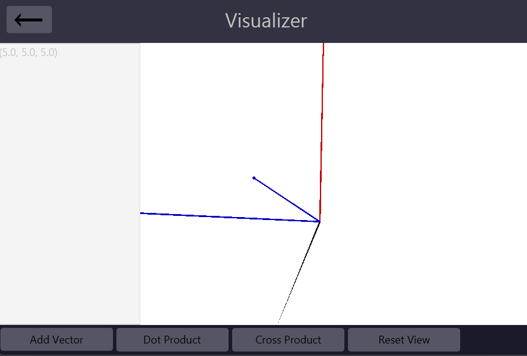

## Linear Algebra Visualizer
### Purpose
This visualizer aims to help visualize how vectors look like on a 3D field while allowing for a 3D view, matrix transforms, and viewing the dot/cross product.

### Features
- Add/Edit/Delete Vectors
- Compute dot product of selected vectors
- Compute cross product of selected vectors
  - Add the cross product to the 3D view
- Transform vectors using transformation matrices

### Future Plans
- Add visualizations for 3x3 matrices including:
  - Column space
  - Row space
  - Null space
  - Left null space
- Demo mode
- Multiple themes

### Running the project
- Requires Java 21 and Maven
- mvn clean compile javafx run

